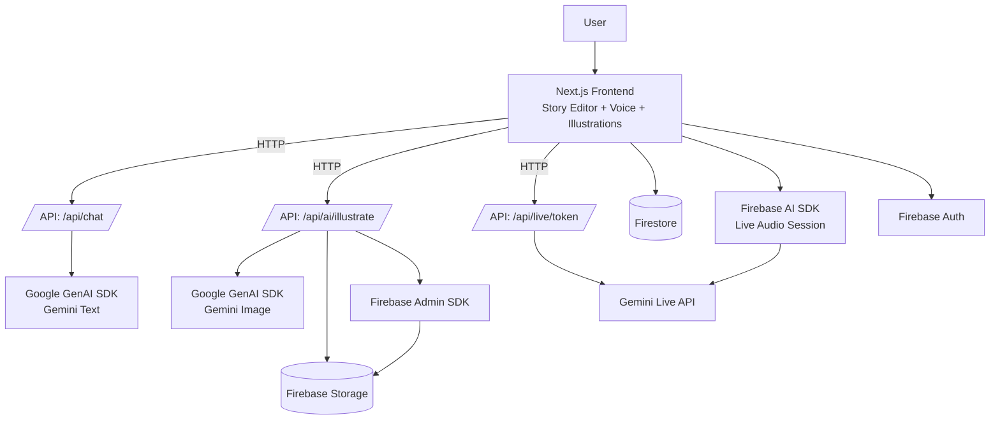
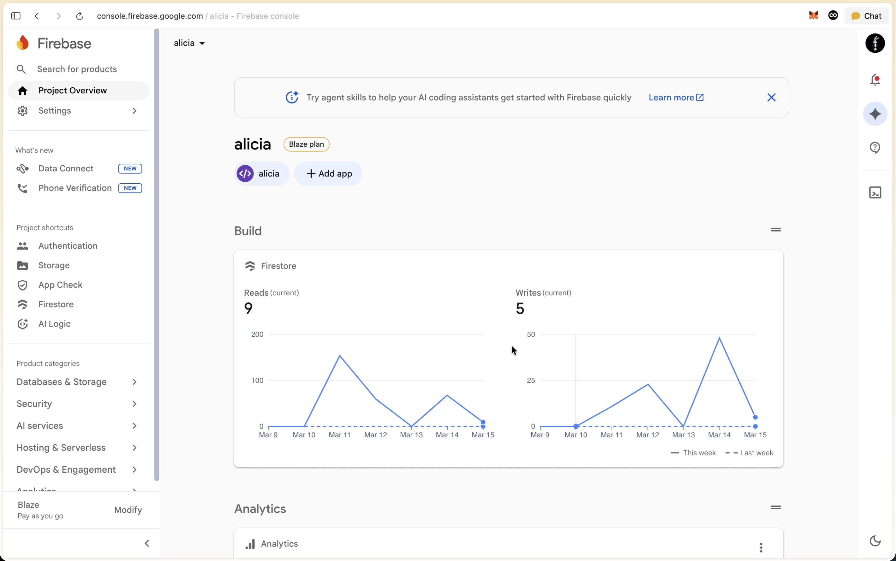

# Alicia — Multimodal Storytelling Agent

## Hackathon Track Submission

We are submitting Alicia to:

- **Creative Storyteller ✍️** (Multimodal Storytelling with interleaved output)
- **Live Agents 🗣️** (Real-time interaction with audio)

Alicia helps kids co-create stories with an AI writing coach, then generate page illustrations, and finally publish a completed storybook.

---

## Judge Quick Navigation

- Feature and requirement summary: [📃 Text Description](#-text-description)
- Architecture view: [🏗️ Architecture Diagram](#️-architecture-diagram)
- Google Cloud deployment proof: [🖥️ Proof of Google Cloud Deployment](#️-proof-of-google-cloud-deployment)
- Reproducible judge testing: [🧪 Reproducible Testing Instructions](#-reproducible-testing-instructions)

---

## 📃 Text Description

### The Problem

Kids have stories in their heads but no scaffolding to get them out. Writing a book is overwhelming — blank page paralysis, no feedback, no reward loop, and nothing tangible to show for the effort. Existing tools either do it for the child (killing ownership) or leave them alone to struggle.

### The Solution — Alicia

Alicia is an AI co-author and writing coach built for kids. It doesn't write the story for you — it helps you write it yourself.

A child starts by setting up their story: characters, setting, and premise. Then, page by page, they write. Alicia's coaching AI gives live contextual feedback through text and voice — nudging the child toward stronger craft (conflict, emotion, pacing) without taking over the pen. When a page is ready, one tap generates a full illustration. By page 12, they have a complete, illustrated storybook they authored.

### The Value

Ownership beats content generation. The child's words are the story. Alicia amplifies them — it doesn't replace them. This makes the output emotionally meaningful and builds real writing skill.

Tangible velocity. A kid can finish their first illustrated storybook in a single session. Visible, holdable progress is the reward — not a completion badge.

Multimodal loop. Text coaching → page writing → AI illustration → voice conversation. Every modality reinforces the same creative act, keeping kids engaged in a way single-mode tools cannot.

Narrative structure by design. The 12-page arc is not arbitrary — it maps to real picture book structure. The AI actively coaches toward a satisfying ending or a continuation hook, so kids internalize story shape without being taught it directly.

The result: a child who sits down with an idea stands up with a book. That's the value.

### What the product does

- **Story creation assistant**: children draft pages with AI support and contextual coaching.
- **Inline illustration workflow**: each page can be turned into a generated image and saved to the project.
- **Live voice mode**: users can talk to Alicia in real time with audio input/output and transcripts.
- **Publishing flow**: completed projects can be published to a marketplace view.

### Core features

- Context-aware story chat with editor insertion support.
- Page-by-page image generation and storage-backed retrieval.
- Real-time audio conversation controls (start/mute/end) with live session state.
- Firestore-backed persistence for projects, pages, chat history, and voice sessions.

### Technologies used

- **Frontend**: Next.js (App Router), React, TypeScript, Tailwind/shadcn UI.
- **AI SDKs**:
  - Google GenAI SDK (`@google/genai`) for text/image generation.
  - Firebase AI SDK (`firebase/ai`) for live audio interactions.
- **Google Cloud services (via Firebase/GCP)**:
  - Firebase Auth
  - Firestore
  - Firebase Storage
  - Firebase AI Logic / Gemini Live integration

### Data sources used

- User-provided story inputs (title, setting, character details, page text).
- In-app generated content (AI responses, page illustrations, transcripts, feedback).
- No third-party external dataset is required for core story generation.

### Findings and learnings

- Combining text and image generation gives a stronger storytelling experience than text-only output.
- Real-time audio UX needs robust handling for mic permissions, reconnects, and fallback messaging.
- Server-side image upload to Storage (instead of returning raw image blobs directly) improves reliability and persistence.
- Structuring prompts with per-page context significantly improves relevance of generated output.

---

## ✅ Mandatory Requirement Checklist

### 1) Leverage a Gemini model

**Implemented.** Alicia uses Gemini models for text, image, and live audio experiences:

- Text model setup: [alicia-monorepo/apps/web/lib/ai/gemini.ts](alicia-monorepo/apps/web/lib/ai/gemini.ts)
- Chat endpoint using Gemini: [alicia-monorepo/apps/web/app/api/chat/route.ts](alicia-monorepo/apps/web/app/api/chat/route.ts)
- Illustration endpoint using Gemini image output: [alicia-monorepo/apps/web/app/api/ai/illustrate/route.ts](alicia-monorepo/apps/web/app/api/ai/illustrate/route.ts)
- Live token endpoint for Gemini Live sessions: [alicia-monorepo/apps/web/app/api/live/token/route.ts](alicia-monorepo/apps/web/app/api/live/token/route.ts)

### 2) Agents built using Google GenAI SDK OR ADK

**Implemented with Google GenAI SDK.**

- SDK dependency: [alicia-monorepo/apps/web/package.json](alicia-monorepo/apps/web/package.json)
- GenAI client initialization (`GoogleGenAI`): [alicia-monorepo/apps/web/lib/ai/gemini.ts](alicia-monorepo/apps/web/lib/ai/gemini.ts)

### 3) Use at least one Google Cloud service

**Implemented (multiple services).**

- Firebase initialization: [alicia-monorepo/apps/web/lib/firebase.ts](alicia-monorepo/apps/web/lib/firebase.ts)
- Firestore persistence and project lifecycle: [alicia-monorepo/apps/web/lib/firestore.ts](alicia-monorepo/apps/web/lib/firestore.ts)
- Firebase Admin Storage upload pipeline: [alicia-monorepo/apps/web/lib/firebase-admin.ts](alicia-monorepo/apps/web/lib/firebase-admin.ts)
- Image generation + Storage upload flow: [alicia-monorepo/apps/web/app/api/ai/illustrate/route.ts](alicia-monorepo/apps/web/app/api/ai/illustrate/route.ts)
- Live voice client with Firebase AI SDK: [alicia-monorepo/apps/web/components/creator/voice-session.tsx](alicia-monorepo/apps/web/components/creator/voice-session.tsx)

---

## Access Control for Reviewer Build

To protect Gemini usage during judging/review windows, Alicia includes an onboarding access gate:

- During the final onboarding step, users can enter a reviewer coupon code.
- If the coupon is valid, the user profile is marked with `freeTrial: true`.
- If the coupon is invalid or empty, `freeTrial` remains `false`.

Access behavior:

- **Allowed for everyone:** Dashboard, Marketplace.
- **Restricted to approved reviewer accounts:** Creator Studio, Alicia AI, Assets, Notifications, Settings, and creator project routes.
- Restricted users see a custom access-blocked screen explaining that this build is reviewer-limited.

---

## Creative Storyteller Track Alignment ✍️

- Alicia delivers multimodal storytelling by combining:
  - narrative text generation,
  - generated illustrations per story page,
  - and contextual coaching in one creation flow.
- The experience is presented as an interleaved story-building workflow where text and media are produced and consumed together inside the editor journey.

Key references:

- Story chat generation: [alicia-monorepo/apps/web/app/api/chat/route.ts](alicia-monorepo/apps/web/app/api/chat/route.ts)
- Illustration generation: [alicia-monorepo/apps/web/app/api/ai/illustrate/route.ts](alicia-monorepo/apps/web/app/api/ai/illustrate/route.ts)
- Illustration UX page: [alicia-monorepo/apps/web/app/creator/[id]/illustrations/page.tsx](alicia-monorepo/apps/web/app/creator/[id]/illustrations/page.tsx)

## Live Agents Track Alignment 🗣️

- Alicia supports natural real-time voice interaction via Gemini Live + Firebase AI SDK.
- Users can start, mute/unmute, and end voice sessions in-app.
- Live configuration includes audio modalities and transcription controls.

Key references:

- Live session UI + audio control logic: [alicia-monorepo/apps/web/components/creator/voice-session.tsx](alicia-monorepo/apps/web/components/creator/voice-session.tsx)
- Live token provisioning endpoint: [alicia-monorepo/apps/web/app/api/live/token/route.ts](alicia-monorepo/apps/web/app/api/live/token/route.ts)

---

## 🏗️ Architecture Diagram

> Pro tip for judges: keep this diagram in your image carousel/file uploads for quick review.



---

## 🖥️ Proof of Google Cloud Deployment

### Code proof (Google Cloud/Firebase service usage)

- Firebase app/auth/db setup: [apps/web/lib/firebase.ts](apps/web/lib/firebase.ts)
- Firestore reads/writes for projects: [apps/web/lib/firestore.ts](apps/web/lib/firestore.ts)
- Firebase Admin SDK storage access: [apps/web/lib/firebase-admin.ts](apps/web/lib/firebase-admin.ts)
- Gemini + live endpoints running in backend routes:
  - [apps/web/app/api/chat/route.ts](apps/web/app/api/chat/route.ts)
  - [apps/web/app/api/ai/illustrate/route.ts](apps/web/app/api/ai/illustrate/route.ts)
  - [apps/web/app/api/live/token/route.ts](apps/web/app/api/live/token/route.ts)

### Video proof

**Google cloud service screen recording:**

> Click thumbnail below to preview

[](https://drive.google.com/file/d/1Kr1nk9O3tFi-0msGhwL0dzPmbvQAZSea/view?usp=drive_link)

- Shows Firebase project overview (project ID).
- Shows Firestore documents updating during app usage.
- Shows Storage receiving generated illustration files.
- Shows app backend route logs while generating chat/image/live token.

---

## 🧪 Reproducible Testing Instructions

These steps let judges run Alicia locally and validate the core experience end-to-end.

### Prerequisites

- Node.js `>=20`
- `pnpm@9`
- A Firebase project configured for Auth, Firestore, and Storage
- Gemini API key access

### 1) Install dependencies

From repo root:

```bash
pnpm install
```

### 2) Configure environment

In `apps/web`, create `.env.local` and copy values from `.env.example`, then set your real credentials:

- `GEMINI_API_KEY`
- `GEMINI_TEXT_MODEL`
- `GEMINI_LIVE_MODEL`
- `REVIEW_ACCESS_CODE` (reviewer coupon)

Also ensure Firebase client/admin env values required by your setup are present.

### 3) Start the app

From repo root:

```bash
pnpm dev
```

Open `http://localhost:3000`.

### 4) Deterministic project checks (CLI)

From repo root:

```bash
pnpm lint
pnpm typecheck
pnpm build
```

Expected result: all commands succeed without errors.

### 5) Manual acceptance checks (judge flow)

1. Sign in and complete onboarding.
1. In the final onboarding step, enter the reviewer code configured in `REVIEW_ACCESS_CODE`.
1. Verify restricted routes are accessible with valid code.

- `/creator`
- `/ai`
- `/assets`

1. Sign out, create/login with an account that does **not** use the valid code.
1. Verify restricted routes show the access-blocked screen, while `/dashboard` and `/marketplace` still work.
1. In creator flow, generate story chat + at least one illustration and confirm persistence (Firestore/Storage).
1. In voice mode, start and stop a live audio session successfully.

This reproduces the main claims for Creative Storyteller + Live Agents tracks and validates reviewer access gating.
